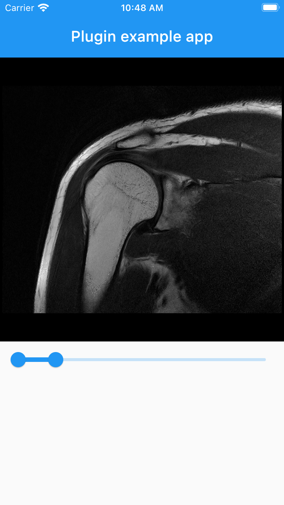
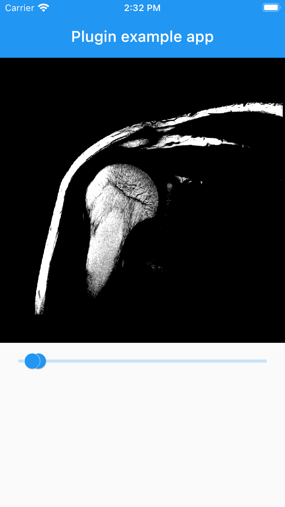

## Features

This plugin can load and display 12 bit JPEG-images. It also supports windowing.




## Usage

```dart
Jpeg12BitWidget(
  input: img,
  windowMin: windowMin,
  windowMax: windowMax,
)
```
